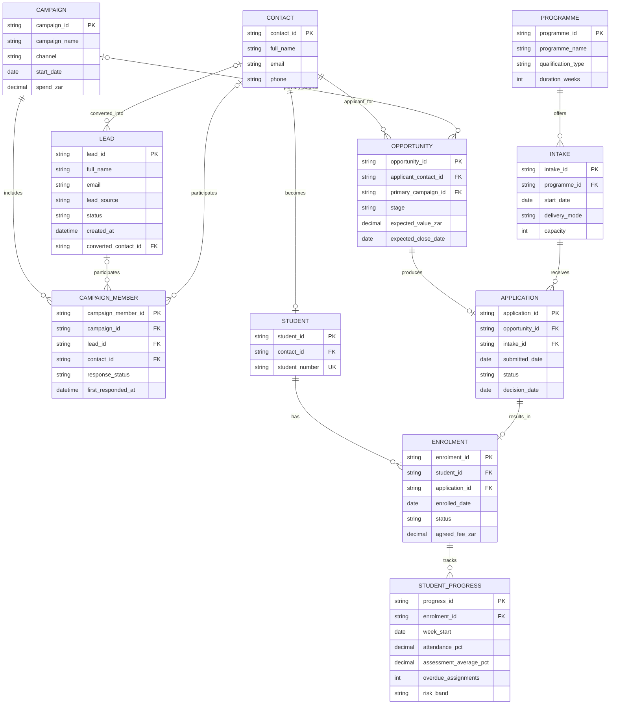
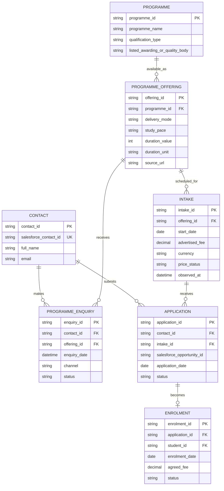
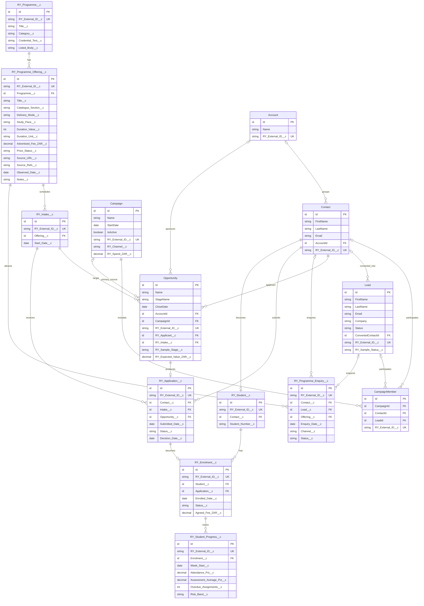
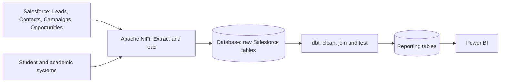

# Red & Yellow diagrams

Canonical version: 03. Archived designs are context only.

## 01_original_conceptual_ARCHIVE

## 02_catalogue_revision_ARCHIVE

## 03_salesforce_canonical

## 04_analytics_pipeline

